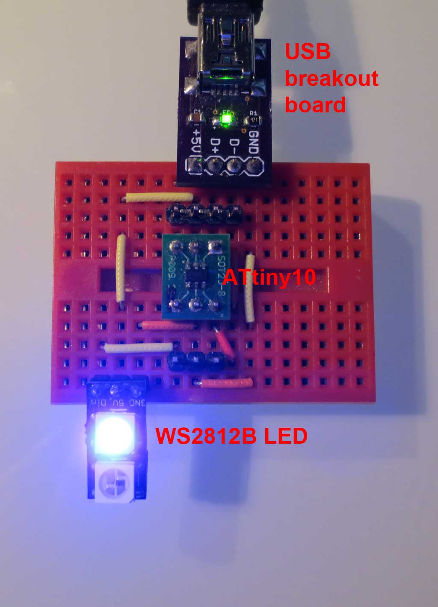

micro-wire
==========

This is an attempt at the smallest possible USB compliant device with V-USB. It uses an ATtiny85 
to control a single WS2812 LED via USB. 

The source started out as an amalganation of micronucleus and littlewire. All excess functionality was cut away.

Update 2014-01-07: It actually works on a ATtiny 10 now, yay! It still suffers from AVR-GCCs inability to generate proper 16 bit STS/LDS. Ticket to Atmel was submitted, let's see if they fix it.

Next step: Design hardware.

### Features ###
 * Enumeration.
 * Only SETUP-request can be received.
 * Responses are limited to strings from flash memory or zero sized replies.
 * All SETUP packets that are not system request are forwarded to a WS2812 RGB LED on PB0.
 
### Memory usage ###
  * 1020 bytes Flash
  * 28 bytes SRAM
  * Uses only regs R16-R31
 
## Test set up ##

